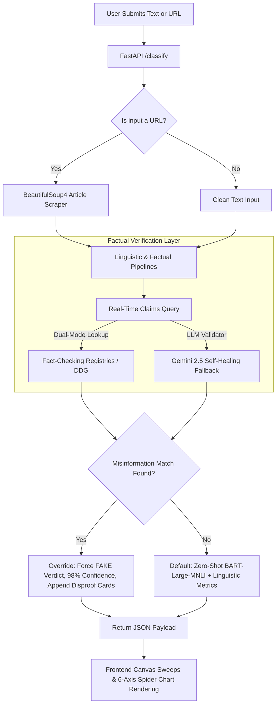

# 📡 FakeNews Radar — Real-Time Misinformation Detection Hub

[](https://huggingface.co/spaces/itachii9090/fake-news-radar)
[](https://fastapi.tiangolo.com/)
[](https://pytorch.org/)
[](https://ai.google.dev/)
[](https://firebase.google.com/)
[](https://www.docker.com/)

An advanced, production-grade hybrid misinformation detection platform combining zero-shot natural language processing, real-time global fact-checking registry search, generative AI cross-referencing, and a Manifest V3 Chrome Extension.

> [!IMPORTANT]
> **Live Production Demo**: Try the fully deployed application live on **[Hugging Face Spaces](https://huggingface.co/spaces/itachii9090/fake-news-radar)**!

---

## 🚀 Key Engineering Highlights (For Employers & Technical Teams)

* **Dual-Layer Factual Verification & Override Filter**: Bypasses the limitation of writing-style classifiers. Intercepts incoming claims by actively searching global fact-checking registries (Google Fact Check API & DuckDuckGo scraper fallback). If a verified hoax matches, the system dynamically overrides the stylistic NLP prediction—setting the verdict to **FAKE** (10% credibility, 98% confidence) and presenting the original disproof reviews.
* **Self-Healing Generative AI Fallback**: Integrates a real-time factual validator powered by **Google Gemini 2.5**. Designed with a sequential fallback connector that loops across 5 version-model configurations (`v1/gemini-2.5-flash`, `v1beta/gemini-pro-latest`, etc.) to self-heal against 404 API restrictions and ensure uninterrupted factual analysis.
* **On-The-Fly Extension ZIP Bundler**: Features a custom FastAPI `/download-extension` GET route that reads the incoming request origin (e.g. localhost, or production HF Space domain) and dynamically compiles and injects the server URL inside the Chrome Extension `popup.js` on-the-fly. This delivers a complete, zero-configuration setup for users.
* **Premium Glassmorphic UI & Canvas Animators**: Rebuilt entirely with a high-fidelity dark mode theme featuring a custom trigonometric sweeping canvas radar, an eased quad count-up stats animator, and an interactive 6-axis credibility spider chart visualizing *Source Trust, Evidence, Bias, Consistency, Transparency, and Accuracy*.
* **Secure Cloud Identity & Sync**: Integrates Firebase Authentication and Cloud Firestore for real-time history syncing, with a graceful fallback to browser `localStorage` if keys are absent (Guest Mode).

---

## 🛠️ Architecture & System Design



---

## 📦 Technology Stack

* **Backend**: Python 3.10, FastAPI, Uvicorn, PyTorch, Hugging Face Transformers (`facebook/bart-large-mnli`), BeautifulSoup4, Requests.
* **Frontend**: Pure Vanilla HTML5, CSS3 (Modern Glassmorphic Dark-Theme), Vanilla JavaScript, Canvas API (Radar sweep & Spider chart), Lucide Icons.
* **Cloud & Database**: Firebase Auth, Google Cloud Firestore.
* **Deployment**: Docker, Hugging Face Spaces (Non-root user UID 1000 compliance).

---

## 💻 Local Development & Setup

### Prerequisites
* Python 3.10+
* Node.js (Optional, for local static serving)
* Google Gemini API Key / Google Fact Check API Key (Optional, for factual overrides)

### 1. Run the Backend Server
```bash
# Clone the repository
git clone https://github.com/MAYANK-af/fakenews-radar.git
cd fakenews-radar/backend

# Create virtual environment
python -m venv .venv
source .venv/bin/activate  # On Windows: .venv\Scripts\activate

# Install dependencies (automatically downgrades numpy to 1.26.4 for PyTorch 2.2.0 compatibility)
pip install -r requirements.txt
pip install beautifulsoup4 lxml

# Configure environment variables
set GEMINI_API_KEY=your_key_here
set GOOGLE_FACT_CHECK_API_KEY=your_key_here

# Start the server (runs on port 8080)
python -m uvicorn main:app --reload --port 8080
```

### 2. Run the Frontend (Local Static Dev)
The FastAPI backend is fully configured to serve the static frontend at `http://localhost:8080/` automatically. Simply open your browser and navigate to `http://localhost:8080`.

---

## 🔌 Manifest V3 Chrome Extension Companion

Deploy the companion browser extension to highlight and scan headlines on any website:
1. **Download the Extension**: Open the FakeNews Radar web app and click the **"Extension"** tab in the navbar. Click the download button to receive a zero-config, customized ZIP containing your server's exact origin.
2. **Install in Chrome**:
   * Navigate to `chrome://extensions/`.
   * Enable **"Developer mode"** in the top right corner.
   * Drag and drop the downloaded ZIP, or click **"Load unpacked"** and select the extracted folder.
3. **Usage**: Highlight any headline or claim on any webpage, right-click, and select **"Verify with Fake News Radar"**. The extension's neon-green radar badge will light up—click it to see a detailed, glassmorphic credibility breakdown instantly.

---

## 🔒 Firebase Configuration (Guest Mode vs Cloud Mode)
To enable cloud identity and real-time Firestore database synchronization, configure the following secrets inside your Hugging Face Space settings or local environment:
* `FIREBASE_API_KEY`
* `FIREBASE_PROJECT_ID`
* `FIREBASE_AUTH_DOMAIN`
* `FIREBASE_STORAGE_BUCKET`
* `FIREBASE_MESSAGING_SENDER_ID`
* `FIREBASE_APP_ID`

*If these variables are omitted, the application operates gracefully in **Guest Mode**, preserving complete functionality using localized browser storage.*

---

## 📝 License
Distributed under the MIT License. See `LICENSE` for more information.
